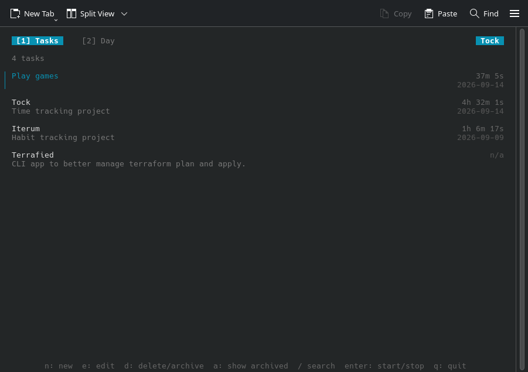
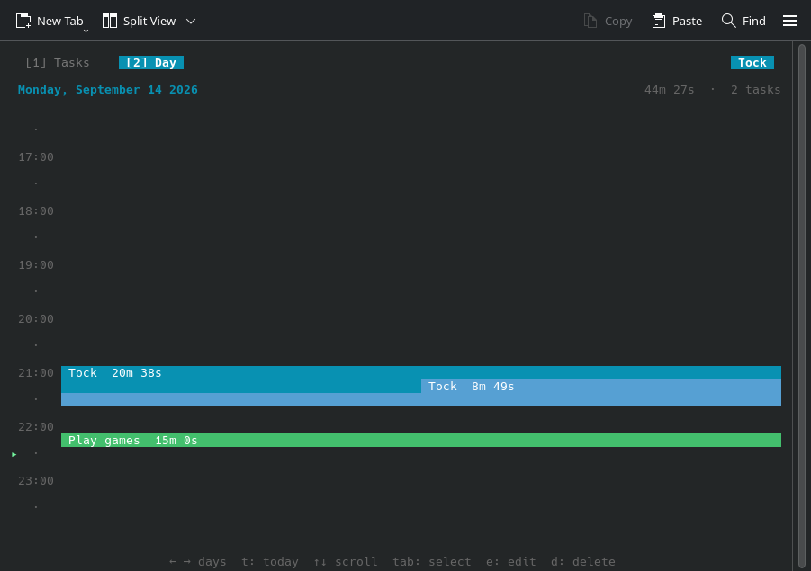
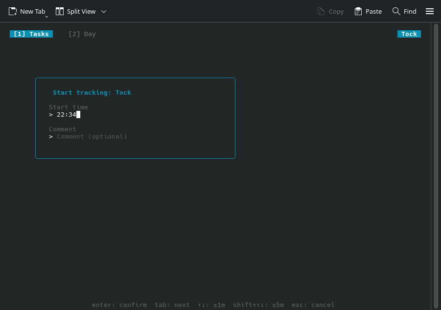
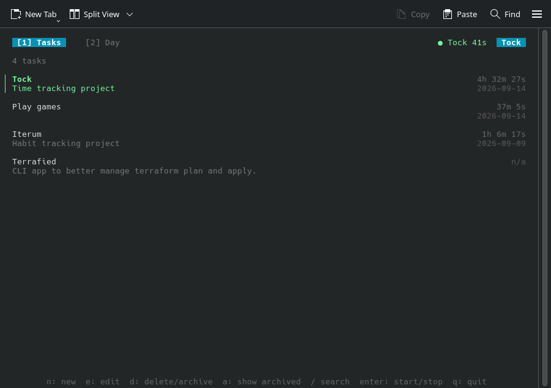

# tock

A terminal time tracker. Track time against tasks, review your day on a timeline.

Built with Go, [Bubble Tea](https://github.com/charmbracelet/bubbletea), and SQLite.

> **Work in progress** — currently in early testing, not ready for daily use.

## Usage

```
task run
```

Data is stored at `~/.config/tock/tock.db` (or `$XDG_CONFIG_HOME/tock/tock.db` if set).

## Screenshots






## Keys

**Tasks tab**

| Key | Action |
|-----|--------|
| `n` | New task |
| `e` | Edit task |
| `d` | Delete / archive task |
| `u` | Unarchive task |
| `a` | Show / hide archived tasks |
| `/` | Search |
| `enter` | Start / stop tracking |
| `q` | Quit |

**Day tab**

| Key | Action |
|-----|--------|
| `← →` | Previous / next day |
| `t` | Jump to today |
| `↑ ↓` | Scroll |
| `tab` | Select entry |
| `e` | Edit entry |
| `d` | Delete entry |

---

Inspired by [hours](https://github.com/dhth/hours) by [@dhth](https://github.com/dhth).
